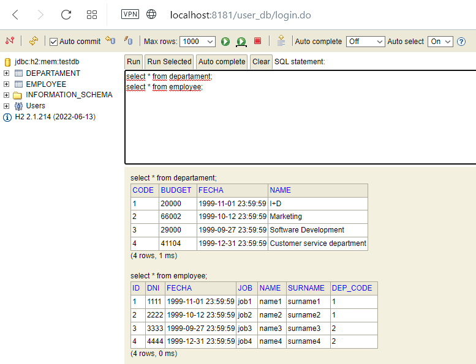
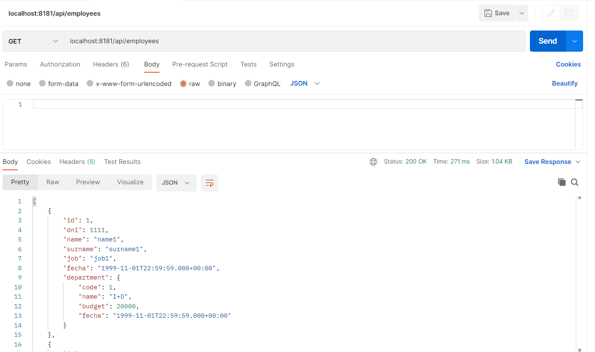
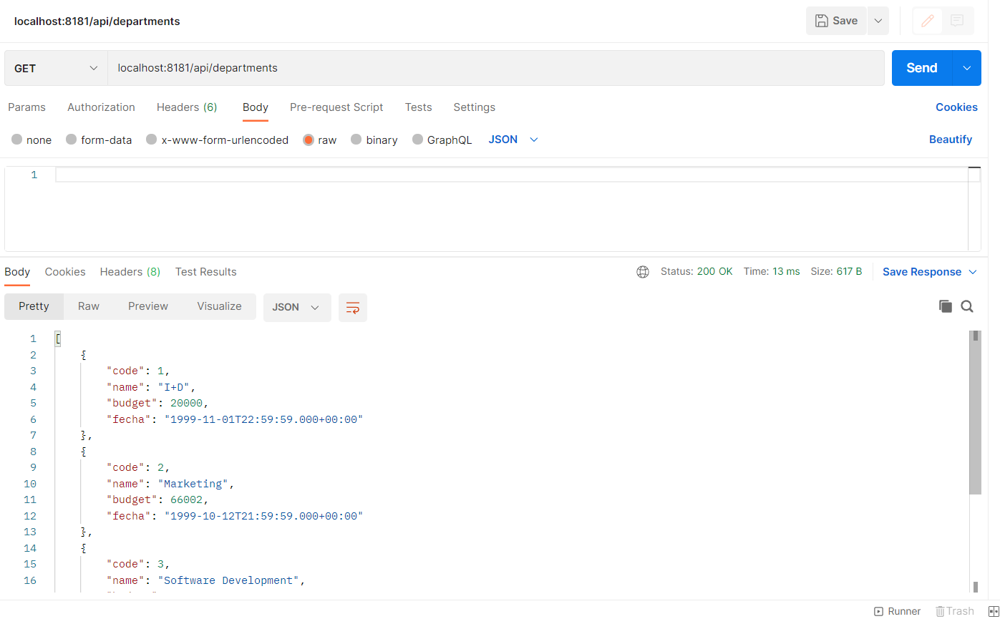

# Spring_REST_API-employee-backend
Spring Project with JPA + H2 (Simple CRUD N:N) + ER with at least Entities.
## ENDPOINTS
```
GET server/api/employees
GET server/api/employees/{id}
GET server/api/departments
GET server/api/departments/{id}
POST server/api/employees
POST server/api/departments
PUT server/api/employees/{id}
PUT server/api/departments/{id}
DELETE server/api/employees/{id}
DELETE server/api/departments/{id}
```



